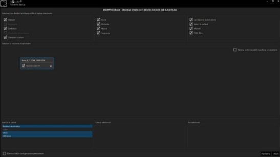

Informazioni di installazione
-----------------------------------------------------------------------------------------
**Operazioni Preliminari** 
Nel caso in cui nel PC sia già installata una versione di bSuite, prima di avviare la procedura di installazione devono essere eseguite le seguenti operazioni

**Creazione di una copia di backup dei dati**

Creare una copia dei dati prima di procedere alla disinstallazione della versione corrente di bSuite e all'installazione del setup. A tal fine procedere come segue:

- Andare in impostazioni generali

 
 

- Selezionare esegui backup

- Scegliere il percorso nel quale salvare il backup
- Attendere la fine del backup.
- Ricordarsi di salvare la cartella di default in documenti chiamata bSolid.
- Chiudere bSolid.

**Arresto dell'applicazione e del WRT**

Per evitare malfunzionamenti, arrestare bSuite e, se si sta lavorando su un PC a bordo macchina, il WRT prima di avviare la disinstallazione dell'applicazione. Il setup di bSuite rileva comunque l'esecuzione di tali processi e chiede che vengano chiusi prima di procedere con l'installazione, la disinstallazione, la modifica o la riparazione.

**Disinstallazione della versione corrente di bSuite**

ATTENZIONE: se la versione commerciale di bSuite da rimuovere è antecedente alla versione 3.0.1, prima di disinstallare bSuite è necessario disinstallare manualmente tutte le patch di aggiornamento eventualmente installate. 
Le patch sono identificabili dal nome "bSuite Patch <Versione>" dove <Versione> è il numero di versione a cui la patch ha aggiornato bSuite (ad es. "bSuite 3.0.1 Patch 3.18.18.0").
Dalla versione 3.0.1, le patch vengono rimosse automaticamente dall'installer. 
Per disinstallare bSuite dal proprio PC aprire "Programmi e funzionalità" dal Pannello di Controllo di Windows e selezionare la voce "bSolid" o "bSuite X.Y.W.Z" dove X.Y.W.Z corrisponde alla versione commerciale (ad es. "bSuite 3.0.6.60") dall'elenco dei programmi.

Premere il pulsante Disinstalla che compare nella toolbar sopra l'elenco dei programmi. 
Alternativamente è possibile eseguire un doppio click sulla voce. 
Apparirà la finestra qui a destra, da cui è possibile premere il pulsante <Disinstalla> in basso a destra per avviare la procedura di disinstallazione.

 

   
**Aggiornamento Driver scheda video dedicata**

A partire dalla versione bSuite 4.0.0 è richiesto l’aggiornamento dei driver della scheda video dedicata all’ultima versione disponibile.
Per eseguire questa operazione è necessario:

1. Aprire il “Pannello di controllo” 
2. Selezionare la voce “Gestione dispositivi”
   
    
   
3. Espandere la sezione “Schede video”
   
    

4. Selezionare con il tasto destro del mouse la scheda video dedicata e selezionare l’opzione “Aggiorna driver”

    

5. Selezionare l’opzione “Cerca automaticamente un driver aggiornato”.
   ATTENZIONE: è necessario che il PC sia collegato alla rete Internet

   

6. Attendere che la verifica dei driver aggiornati e l’eventuale installazione termini con successo

   

**Configurazione scheda video NVidia** 

NOTA: mentre bSuite è in esecuzione non è possibile modificare la dimensione di testo dello schermo. 

Passi da eseguire nel “Pannello di controllo NVIDIA”: 

1. Nella sezione “Regola le impostazioni dell’immagine con anteprima” abilitare il parametro “Usa le impostazioni dell’immagine 3D avanzate” 
   
   
   
2. Cliccare sul link “Apri la pagina” accanto al parametro “Usa le impostazioni dell’immagine 3D avanzate” 
   
3. Selezionare la voce “Profilo base” nei “Predefiniti globali”
   
   
   
4. ”Premere il pulsante “Ripristina” per resettare i valori di default (se uno o più di essi era stato precedentemente modificato)
   
5. In caso si tratti di un laptop, selezionare la voce “Processore NVIDIA ad alte prestazioni” in “Processore grafico preferito”
   
6. Nell’elenco sottostante  “Impostazioni:”, ricercare il parametro “Modalità di gestione dell’alimentazione” ed impostare il valore “Preferisci le prestazioni massime” 

   
   
7. Applicare le modifiche effettuate cliccando sul comando “Applica” (pulsante in basso a destra) 

   

**Operazioni preliminari su alcuni sistemi operativi**
   
ATTENZIONE: Durante l'installazione su WINDOWS 10 si potrebbe riscontrare un'anomalia relativa
all'impossibilità di installare il pacchetto di .NET Framework 3.5: tale software è un prerequisito dell'applicazione e deve quindi essere installato obbligatoriamente.
Per installare il software in tale sistema operativo è possibile utilizzare una delle seguenti opzioni:

**Abilitare .NET Framework 3.5 dal Pannello di Controllo**
   
La procedura di seguito descritta necessita di una connessione Internet attiva:

1. Premere il tasto Windows  sulla tastiera, digitare Funzionalità Windows e premere Invio. 
Verrà visualizzata la finestra di dialogo Attivazione o disattivazione delle funzionalità Windows. 
In alternativa, aprire Pannello di controllo, fare clic sugli elementi Programmi e quindi fare clic su "Attivazione o disattivazione delle funzionalità Windows" in Programmi e funzionalità. 

1. Selezionare la casella di controllo .NET Framework 3.5 (include .NET 2.0 e 3.0), fare clic su OK e riavviare il computer, se richiesto.
   

   
**Abilitare .NET Framework 3.5 da linea di comando**
   
E' possibile installare .NET Framework 3.5 anche in assenza di una connessione Internet, utilizzando la seguente procedura:

1. Caricare il CD/DVD di installazione del sistema operativo in uso. Se si è in possesso dell'immagine ISO, è possibile installarla cliccando col tasto destro del mouse sul file e selezionare la voce di menu "Monta"

2. Aprire la console di Windows in modalità Amministratore e scrivere la seguente linea di comando: 
Dism /online /enable-feature /featurename:NetFx3 /All /Source:<Windows Setup Drive>\sources\sxs/LimitAccess 
Dove <Windows Setup Drive> è la lettera che contraddistingue il drive in cui è presente il CD/DVD di installazione di Windows o in cui è stata installata l'immagine ISO del sistema operativo. 
Ad esempio
Dism /online /enable-feature /featurename:NetFx3 /All /Source:D:\sources\sxs /LimitAccess
Una volta avviato il comando premendo il tasto invio, Windows installerà .NET Framework 3.5 sul PC.

**Installazione di bSuite** 
   
NOTE: 
- Prima di avviare l'installazione di B\_SUITE è necessario assicurarsi che l'utenza in uso abbia i diritti di amministratore del PC.
- Per evitare possibili conflitti con applicazioni esterne è strettamente necessario NON eseguire il setup di installazione dal Desktop del PC e/o dalla cartella “Documenti”.

1. Copiare la cartella dell'installer sul proprio PC. 
**ATTENZIONE: non bisogna in alcun modo copiare la cartella dell'installer di bSuite dentro una delle cartelle di destinazione (ad esempio C:\Biesse o C:\WNC) in quanto la presenza del setup in tali cartelle potrebbe creare dei problemi potenzialmente bloccanti per l'installazione.**

2. All'avvio del setup, apparirà la seguente finestra

3. Premendo il pulsante <Avanti> verrà mostrato il contratto di licenza con l'utente finale

4. Per proseguire con l'installazione è necessario accettare i termini del contratto di licenza attivando la spunta corrispondente (evidenziata nell'immagine con un rettangolo rosso).

Si attiverà il pulsante <Avanti> per passare alla schermata successiva, che consente di selezionare il tipo di materiale su cui si intenderà lavorare.

**Opzioni di Installazione** 
La schermata è suddivisa in quattro schede (Pacchetti, Dati di Esempio, Lingue ed Opzioni).
   

   
**Pacchetti** 
La scheda <Pacchetti> consente di selezionare i componenti di base di bSuite e gli eventuali pacchetti opzionali. Saranno quindi disponibili i 2 pacchetti “bEdge”, “bNest”.

   
NOTA: il check “Installazione a bordo macchina” si attiverà automaticamente nel caso in cui nel PC verrà rilevata la presenza dell’applicativo “WRT” (come nel caso dei computer a bordo macchina).
Con questo check disattivato (modalità ufficio) l’installazione di bSuite PROVVEDERA’ AD INSTALLARE ANCHE IL WRT.

   

**Lingue** 
La scheda <Lingue> consente di selezionare una o più lingue da installare.

La lingua inglese (EN) viene sempre installata e non è quindi possibile deselezionarla. Di default il setup attiva la lingua correntemente selezionata, visibile in alto a destra vicino ai pulsanti di chiusura e riduzione a icona della finestra (nell'immagine sopra è stata evidenziata con un rettangolo rosso). Cliccando sulla lingua corrente del setup, è possibile selezionare una lingua diversa da quella attualmente utilizzata: il setup aggiornerà la finestra automaticamente (nell'immagine seguente, ad esempio, l'utente ha selezionato la lingua tedesca).

   

**Opzioni** 
La scheda <Opzioni> consente di selezionare il file contenente il badge di licenza software

Di default, il setup installerà il software nella cartella C:\BIESSE

   

**Avvio dell'Installazione** 
Una volta configurata l'installazione, sarà possibile avviarla premendo il pulsante <Installa>. 
Verrà mostrata una barra di avanzamento che consentirà all'utente di capire fino a che punto è arrivata l'installazione dei componenti selezionati.

   

**Attivazione firewall** 
Se è attivo Windows Firewall, durante l'installazione potrebbero apparire alcune finestre che richiedono l'autorizzazione ad accedere alla rete per alcune applicazioni. Consentire l'accesso alla rete privata, come evidenziato nell'immagine sotto

   

**Operazioni finali**
Una volta installato bSuite nel PC, eseguire le seguenti operazioni:

**Ripristino di una copia di backup**
In generale, se si è creata una copia di backup dei dati, come specificato in "Creazione di una copia di backup dei dati" (sez.5.1.1), è possibile ripristinare la situazione precedente all'installazione di bSuite eseguendo le seguenti operazioni:

1. Ricercare la cartella in cui sono stati depositati i file di backup.

2. Cliccare due volte sul file .bBack desiderato, o in alternativa trascinarlo sull'icona di bSuite che si trova sul Desktop. Si aprirà la finestra di ripristino dei dati:

3. Marcare le caselle corrispondenti ai dati da ripristinare (notare che le caselle corrispondenti agli oggetti non presenti nell'archivio di backup sono disabilitate):
- **Utensili** 
  Salva la lista degli utensili nel database degli utensili. In tal caso, gli utensili con lo stesso nome verranno sovrascritti.
- **Aggregati** 
Salva la lista degli aggregati nel database degli utensili. In tal caso, gli aggregati con lo stesso nome verranno sovrascritti.
- **Deflettori** 
Salva la lista dei deflettori nel database degli utensili. In tal caso, i deflettori con lo stesso nome verranno sovrascritti.
- **Sequenze** 
Salva la lista delle sequenze nel database delle sequenze
- **Operazioni di lavorazione automatica** 
Salva l'elenco delle operazioni di lavorazione automatica nel database di lavorazione automatica.
- **Valori predefiniti** 
Sovrascrive i dati di lavorazione e geometria salvati come predefiniti nella scheda Avanzate dell'area dei parametri.
- **Listelli di bordatura** 
Salva l'elenco dei bordi nel database degli strumenti. I bordi con lo stesso nome verranno sovrascritti.
- **Etichette** 
Salva l'elenco delle etichette nel database degli strumenti. Le etichette con lo stesso nome verranno sovrascritte.
- **Macro** 
Salva l'elenco delle macro nel database delle macro. Le macro con lo stesso nome verranno sovrascritte.
- **Modelli** 
Salva l'elenco dei modelli, quelli utilizzati per creare un nuovo documento (programma di lavorazione).
- **File CAM** 
Aggiorna il contenuto della cartella "... Biesse bS solid"
- **Morsa personalizzata** 
Salva l'elenco delle Morse personalizzate nel database delle Morse. Le Morse con lo stesso nome verranno sovrascritte.

4. Nel campo dati "Seleziona le macchine da ripristinare", seleziona le macchine da ripristinare: la selezione è evidenziata da una cornice blu. Per impostazione predefinita, tutte le macchine nel file di backup sono già selezionate. Per selezionare/deselezionare una macchina, fare clic sul suo nome. Per impostare una macchina come predefinita quando bSuite si avvia, fare clic sull'icona a forma di stella in basso a destra (la stella diventerà gialla). 
Per rimuovere l'impostazione predefinita della macchina, fare nuovamente clic sull'icona a forma di stella (la stella diventerà grigia). Per ripristinare anche i dati WRT, attivare la casella di controllo "Ripristina dati CN". Questo controllo è presente solo se i dati NC sono disponibili per la corrispondente macchina.

5. Selezionare la casella di controllo "Elimina tutti i modelli di macchine preesistenti" solo se si desidera eliminare tutti i modelli di macchine esistenti (ad esempio quelli importati dall'installazione di bSuite) e mantenere solo quelli nel file di backup.

6. Selezionare la casella di controllo "Elimina dati e configurazioni esistenti" solo se si desidera eliminare tutti i dati nella fase di ripristino per sostituirli con quelli prelevati dal file di backup. In caso contrario, per sovrascrivere quelli esistenti e aggiungerne di nuovi, lasciare la casella disattivata.

7. Fare clic sul pulsante <Ripristina>.

8. Attendere il completamento dell'operazione di ripristino, quindi chiudere il dialogo e avviare bSuite.

   

**Eventuali anomalie riscontrate all'avvio dell'applicazione** 
Quando viene eseguita l'installazione di bSuite, eventuali files di configurazione di un'installazione precedente presenti nella cartella utente Documenti\Biesse Spa\bSuite che non vengono rimossi dalla disinstallazione, vengono modificati oppure eliminati (in quest'ultimo caso viene creata una copia di backup del file con estensione.bak) per far sì che bSuite si avvii con le nuove impostazioni risultanti dalle opzioni selezionate nell'interfaccia dell'installatore. 
Se si riscontrano delle anomalie all'avvio dell'applicazione, chiudere bSuite ed eliminare manualmente il file SuiteSetup.bSetup presente nella cartella Documenti\Biesse Spa\bSuite. 
La rimozione del file assicura che al riavvio dell'applicazione verrà ricreato il file di configurazione in base alle selezioni effettuate dall'utente al momento dell'installazione. 
Se l'anomalia persiste è necessario chiamare l'assistenza tecnica di Biesse S.p.A.
